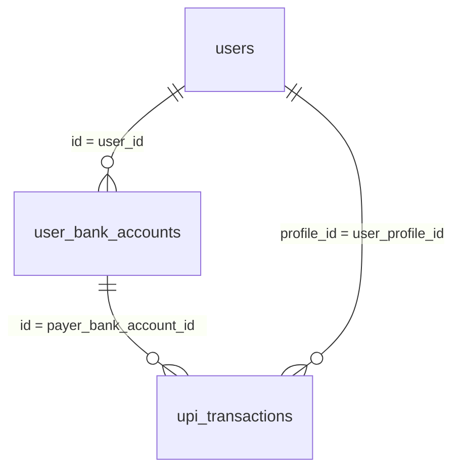

# UPI warehouse schema reference (3 tables)

**Project:** `bharatpe-analytics-prod`  
**Dataset:** `upi`  
**Location:** `asia-south1`  
**Documented:** 2026-05-25 via BigQuery MCP (`get_table_info`, profiling on all three tables below)

**Note:** `payment_instrument` is not a warehouse table; use **`user_bank_accounts`** as the linked bank-account / payment-instrument dimension.

This file captures column-level understanding for retention and cohort work. **Scope is limited to the three tables below** — no other `upi.*` tables are documented here.

---

## Retention scope: outward (payout) vs pay-in

Your rule (product definition):

| Direction | Filter on transaction row |
|-----------|---------------------------|
| **Pay-in (incoming)** | `type = 'RECEIVE_EXTERNAL'` |
| **Payout (outward)** | `type != 'RECEIVE_EXTERNAL'` (everything else) |

**All retention metrics you described should use outward / payout rows only.**

### Important: `type` vs `subType` on `upi_transactions` (verified in data)

On SUCCESS rows (last 90 days, `__deleted = 'false'`):

| Check | Count |
|-------|------:|
| `type = 'RECEIVE_EXTERNAL'` | **0** |
| `subType = 'RECEIVE_EXTERNAL'` | **17,833,410** |
| Total SUCCESS | 25,536,704 |

Observed values:

- **`type`** (high level): `PAY`, `COLLECT`, `PAY_TO_GLOBAL` — not used for `RECEIVE_EXTERNAL` in the warehouse.
- **`subType`** (rail / flow): `RECEIVE_EXTERNAL` is the pay-in label; outward flows include `QR`, `UPI_ID`, `UPI_NUMBER`, `CONTACT`, `INTENT`, `COLLECT_MANDATE`, `BANK_TRANSFER`, `SELF_TRANSFER`, `COLLECT_EXTERNAL`, and NULL.

Pay-in rows in practice pair as `type = 'PAY'` and `subType = 'RECEIVE_EXTERNAL'`.

**Implication:** Filtering payout with `type != 'RECEIVE_EXTERNAL'` does **not** remove pay-ins (because `type` is never `RECEIVE_EXTERNAL`). For warehouse retention that matches “outward only,” you will need to align with you on whether to use your `type` rule as stated or `subType != 'RECEIVE_EXTERNAL'` (and how to treat NULL `subType`). Confirm before running retention SQL.

Suggested outward filter candidates (for discussion only):

```sql
-- Your stated rule (does not exclude pay-ins in current data)
type != 'RECEIVE_EXTERNAL'

-- Matches pay-in label in data today
subType IS DISTINCT FROM 'RECEIVE_EXTERNAL'
-- or: (subType IS NULL OR subType != 'RECEIVE_EXTERNAL')
```

Standard row hygiene for transaction facts (used in existing cohort SQL in this repo):

```sql
status = 'SUCCESS'
AND user_profile_id IS NOT NULL AND user_profile_id != ''
AND IFNULL(__deleted, 'false') = 'false'
```

Partition filter on `DATE(created_at)` recommended for cost control.

---

## Table 1: `upi.upi_transactions`

**Full ID:** `bharatpe-analytics-prod.upi.upi_transactions`  
**Role:** One row per UPI transaction attempt/outcome — primary fact for retention, volume buckets, MCC, QR, amounts.  
**Scale (MCP):** ~81.6M rows · ~61 GB · partitioned **DAY** on `created_at` · clustered on `id`

### Column reference

| Column | Type | Description / usage |
|--------|------|---------------------|
| `id` | INTEGER | Surrogate PK for the row |
| `transaction_id` | STRING | Business / gateway transaction id |
| `original_transaction_id` | STRING | Parent txn id (reversals / linked txns) |
| `payer_vpa` | STRING | Payer VPA |
| `payee_vpa` | STRING | Payee VPA |
| `payee_account_number` | STRING | Payee account number |
| `payee_ifsc_code` | STRING | Payee IFSC |
| `payee_bank_account_id` | INTEGER | FK-style id to payee bank account entity |
| `payer_bank_account_id` | INTEGER | FK-style id to payer bank account entity |
| `payer_name` | STRING | Payer display name |
| `payee_name` | STRING | Payee display name |
| `status` | STRING | Lifecycle status; **use `SUCCESS` for retention** |
| `type` | STRING | High-level txn class: `PAY`, `COLLECT`, `PAY_TO_GLOBAL` |
| `subType` | STRING | Flow/rail; **`RECEIVE_EXTERNAL` = pay-in in data** |
| `bank_rrn` | STRING | Bank RRN |
| `user_profile_id` | STRING | **User key** — join to `users.profile_id` |
| `upi_trans_log_id` | INTEGER | Link to UPI transaction log |
| `response_code` | STRING | Bank/gateway response code |
| `note` | STRING | Free-text note |
| `pre_approved` | STRING | Pre-approval flag |
| `txn_message` | STRING | Txn message |
| `ref_url` | STRING | Reference URL |
| `notification_id` | STRING | Notification id |
| `default_account` | STRING | Default account flag |
| `device_id` | STRING | Device id |
| `umn` | STRING | UPI mandate / merchant number |
| `expire_at` | TIMESTAMP | Expiry |
| `txn_init_date` | TIMESTAMP | Initiation time |
| `txn_complete_date` | TIMESTAMP | Completion time |
| `mcc` | STRING | Merchant category code (outward merchant spend) |
| `amount` | BIGNUMERIC | Transaction amount |
| `created_at` | TIMESTAMP | **Partition key** — primary time axis for cohorts |
| `updated_at` | TIMESTAMP | Row update time |
| `payer_account_number` | STRING | Payer account number |
| `payer_account_ifsc_code` | STRING | Payer IFSC |
| `currency_status` | STRING | Currency status |
| `base_amount` | STRING | Base amount (pre-adjustment) |
| `last_modified_timestamp` | STRING | Last modified (string) |
| `currency_fx` | STRING | FX info |
| `mkup` | STRING | Markup |
| `currency` | STRING | Currency code |
| `attributes` | STRING | JSON / serialized attributes |
| `latitude` | BIGNUMERIC | Geo latitude |
| `longitude` | BIGNUMERIC | Geo longitude |
| `delegate_account_id` | INTEGER | Delegate account |
| `is_bharatpe_qr` | INTEGER | 1 if BharatPe QR (outward segmentation) |
| `reward_amount` | BIGNUMERIC | Reward component |
| `upi_amount` | BIGNUMERIC | UPI amount component |
| `__deleted` | STRING | Soft-delete flag — filter `'false'` |
| `_metadata_*` | various | Ingestion / CDC metadata (pipeline) |

### `status` distribution (last 90 days, all statuses)

| status | Approx. rows |
|--------|-------------:|
| SUCCESS | 25,523,696 |
| FAILED | 3,119,276 |
| USER_ABORTED | 439,148 |
| Others | smaller |

### Outward `subType` mix (SUCCESS, excluding `RECEIVE_EXTERNAL`, last 90 days)

| subType | Approx. rows |
|---------|-------------:|
| QR | 5,156,918 |
| UPI_ID | 1,269,158 |
| UPI_NUMBER | 396,343 |
| CONTACT | 363,052 |
| INTENT | 284,412 |
| COLLECT_MANDATE | 137,787 |
| BANK_TRANSFER | 36,688 |
| SELF_TRANSFER | 32,429 |
| COLLECT_EXTERNAL | 20,884 |
| NULL | 1,110 |

---

## Table 2: `upi.users`

**Full ID:** `bharatpe-analytics-prod.upi.users`  
**Role:** UPI user dimension — profile, VPA, client, lifecycle status.  
**Scale (MCP):** ~6.46M rows · partitioned **DAY** on `created_at` · clustered on `id`

### Column reference

| Column | Type | Description / usage |
|--------|------|---------------------|
| `id` | INTEGER | Internal user row id (not the same as `profile_id`) |
| `vpa` | STRING | User’s VPA handle |
| `profile_id` | STRING | **Join key** ↔ `upi_transactions.user_profile_id` |
| `mobile` | STRING | Mobile number |
| `client` | STRING | App/client; observed **100% `POSTPE`** in current data |
| `client_reference_id` | STRING | Client-specific reference |
| `first_name` | STRING | First name |
| `last_name` | STRING | Last name |
| `status` | STRING | `ACTIVE`, `INIT`, `DEREGISTERED`, … |
| `created_at` | TIMESTAMP | User created (partition field) |
| `updated_at` | TIMESTAMP | Last update |
| `attributes` | STRING | Extra attributes |
| `type` | STRING | User type (domain-specific) |
| `sms_sync_time_stamp` | INTEGER | SMS sync epoch |
| `__deleted` | STRING | Soft-delete — filter `'false'` |
| `_metadata_*` | various | Ingestion metadata |

### `status` distribution (non-deleted)

| status | Approx. rows |
|--------|-------------:|
| ACTIVE | 4,408,096 |
| INIT | 2,038,540 |
| DEREGISTERED | 8,912 |

### Join to transactions

```sql
FROM upi.upi_transactions t
JOIN upi.users u
  ON t.user_profile_id = u.profile_id
 AND IFNULL(u.__deleted, 'false') = 'false'
```

Use **`profile_id`**, not `users.id`, when linking to transaction facts.

---

## Table 3: `upi.user_bank_accounts`

**Full ID:** `bharatpe-analytics-prod.upi.user_bank_accounts`  
**Replaces:** `payment_instrument` (not present in BigQuery; this is the payment-instrument / linked-bank-account table in `upi`).  
**Role:** One row per user-linked bank account used for UPI (primary account, IFSC, onboarding, UPI Lite, global txn flags).  
**Scale (MCP):** ~5.15M rows · ~3 GB · partitioned **DAY** on `created_at` · clustered on `id`

### Column reference

| Column | Type | Description / usage |
|--------|------|---------------------|
| `id` | INTEGER | **Surrogate PK** — join from `upi_transactions.payer_bank_account_id` / `payee_bank_account_id` |
| `user_id` | INTEGER | **Join key** ↔ `users.id` (internal user id, not `profile_id`) |
| `is_primary` | INTEGER | Primary linked account flag |
| `account_number` | STRING | Bank account number |
| `ifsc_number` | STRING | IFSC |
| `aadhaar_no` | STRING | Aadhaar reference |
| `account_ref_number` | STRING | Bank/account reference number |
| `account_type` | STRING | Account type (savings/current, etc.) |
| `mmid` | STRING | Mobile money identifier |
| `mbeba` | INTEGER | Mobile banking enabled flag (domain-specific) |
| `aeba` | INTEGER | Aadhaar-enabled bank account flag (domain-specific) |
| `creds_allowed` | STRING | Allowed credential types |
| `status` | STRING | Account status; observed **`A`** (active), **`P`** (pending) |
| `created_at` | TIMESTAMP | Account linked / created (partition field) |
| `updated_at` | TIMESTAMP | Last update |
| `account_provider_id` | INTEGER | PSP / provider id |
| `user_bank_status` | STRING | Extended bank-link status |
| `default_debit` | STRING | Default for debit |
| `default_credit` | STRING | Default for credit |
| `aadhar_otp` | STRING | Aadhaar OTP flow marker |
| `merchant_genre` | STRING | Merchant genre (if applicable) |
| `name` | STRING | Account holder name on record |
| `onboarding_type` | STRING | How the account was onboarded |
| `account_identifier` | STRING | External account identifier |
| `lrn` | STRING | Lite / LRN reference |
| `upi_lite_status` | STRING | UPI Lite status |
| `allow_global_txn` | STRING | Global txn allowed flag |
| `global_start_date` | STRING | Global txn window start |
| `global_end_date` | STRING | Global txn window end |
| `default_merchant_account` | INTEGER | Default merchant account id |
| `__deleted` | STRING | Soft-delete — filter `'false'` |
| `_metadata_*` | various | Ingestion metadata |

### `status` distribution (non-deleted)

| status | Approx. rows |
|--------|-------------:|
| A | 5,149,039 |
| P | 1,941 |

### Joins (verified)

**To `users`:**

```sql
FROM upi.user_bank_accounts b
JOIN upi.users u
  ON b.user_id = u.id
 AND IFNULL(u.__deleted, 'false') = 'false'
WHERE IFNULL(b.__deleted, 'false') = 'false'
```

All non-deleted bank-account rows match a `users` row on `user_id` = `users.id` (MCP check).

**To `upi_transactions` (outward / payer side):**

For payout rows, the user’s funding account is typically on the **payer** side:

```sql
FROM upi.upi_transactions t
JOIN upi.user_bank_accounts b
  ON t.payer_bank_account_id = b.id
 AND IFNULL(b.__deleted, 'false') = 'false'
```

On outward SUCCESS txns (last 7 days, `subType` not `RECEIVE_EXTERNAL`), `payer_bank_account_id` is populated on ~645k rows and **~100%** match `user_bank_accounts.id`.

**End-to-end path (user → bank account → outward txn):**

```sql
FROM upi.upi_transactions t
JOIN upi.users u
  ON t.user_profile_id = u.profile_id
 AND IFNULL(u.__deleted, 'false') = 'false'
JOIN upi.user_bank_accounts b
  ON b.user_id = u.id
 AND t.payer_bank_account_id = b.id
 AND IFNULL(b.__deleted, 'false') = 'false'
```

Use `payee_bank_account_id` only when the analysis needs the counterparty account (e.g. pay-in / receive flows).

---

## Cross-table relationships (only these three)



| From | To | Key | Notes |
|------|-----|-----|--------|
| `upi_transactions` | `users` | `user_profile_id` = `profile_id` | Primary user attribution on txn fact |
| `users` | `user_bank_accounts` | `users.id` = `user_bank_accounts.user_id` | User → linked accounts (1:N) |
| `upi_transactions` | `user_bank_accounts` | `payer_bank_account_id` = `id` | Outward txn funding account |
| `upi_transactions` | `user_bank_accounts` | `payee_bank_account_id` = `id` | Optional; payee / receive side |

---

## Defaults for downstream retention analysis

When you give instructions for retention-by-transaction-bucket:

1. **Population:** outward / payout only (per your definition — confirm `type` vs `subType` filter).
2. **User grain:** `user_profile_id` on SUCCESS outward txns.
3. **Time:** `created_at` (partitioned); cohort month = calendar month of first qualifying outward SUCCESS.
4. **Activity:** subsequent calendar months with ≥1 outward SUCCESS.
5. **User dim:** optional enrichments from `users` (e.g. `status = 'ACTIVE'`, `client`).
6. **Payment instrument dim:** optional enrichments from `user_bank_accounts` (e.g. `is_primary`, `account_type`, `onboarding_type`) via `payer_bank_account_id` or `users.id`.

---

## MCP verification log

| Table | `get_table_info` | Sample query |
|-------|------------------|--------------|
| `upi_transactions` | OK | OK |
| `users` | OK | OK |
| `user_bank_accounts` | OK | OK |

---

*Source queries run against `bharatpe-analytics-prod.upi` only. No other datasets or `upi` sibling tables were scanned per scope.*
